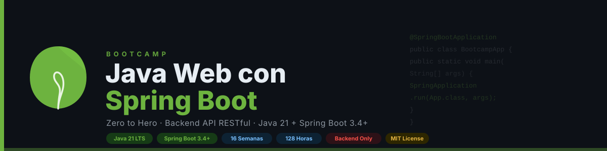

[](CONTRIBUTING.md)

[Versión en Español](README.md)

---

## 📋 Description

Intensive 16-week (~4 months) bootcamp focused on mastering Spring Boot and modern **backend RESTful API** development with Java.
Designed to take students with prior knowledge of Java basics and OOP to **Junior Backend Developer** level,
with emphasis on clean code, best practices, architecture patterns, and real-world projects.

> ⚠️ **Scope:** This bootcamp covers **backend only** (RESTful API). The frontend (React) is addressed in a separate bootcamp.

> **Prerequisite:** Basic Java and Java OOP ✅

### 🗺️ Bootcamp Ecosystem

This bootcamp is part of a complete learning path:

| Bootcamp | Technology | Description |
|----------|-----------|-------------|
| **This bootcamp** | Spring Boot + Java | Backend RESTful API |
| [bc-react](https://github.com/ergrato-dev/bc-react) | React | Frontend SPA |
| **Integrating Project** | Spring Boot + React + PostgreSQL | Full-stack with and without Docker |

### 🎯 Learning Objectives

Upon completing the bootcamp, students will be able to:

- ✅ Master modern Java (Streams, Lambdas, Records, Generics, Optional)
- ✅ Build complete RESTful APIs with Spring Boot
- ✅ Implement data validation with Jakarta Bean Validation
- ✅ Work with databases using Spring Data JPA + Hibernate
- ✅ Implement authentication and authorization (JWT, OAuth2) with Spring Security
- ✅ Write automated tests with JUnit 5, Mockito, and Testcontainers
- ✅ Auto-document APIs (OpenAPI/Swagger with SpringDoc)
- ✅ Deploy applications with Docker and CI/CD via GitHub Actions
- ✅ Apply layered architecture and hexagonal architecture
- ✅ Build complete projects ready for production

### 🚀 Why Spring Boot?

> Modern Spring Boot from day 1 — No legacy code, only current best practices.

Spring Boot is the most widely adopted Java framework in the enterprise industry. This bootcamp focuses
on Spring Boot 3.x with Java 21+ and the modern features of the Spring ecosystem, building
**robust, production-ready RESTful APIs** — no frontend, no HTML, no CSS.
Students learn directly the tools and techniques they will use in the professional world.

---

## 🗓️ Bootcamp Structure

| Phase | Weeks | Hours | Content |
|-------|-------|-------|---------|
| Spring Core & Boot | 1–3 | 24h | Modern Java, IoC/DI, auto-config, REST MVC |
| Validation & Docs | 4 | 8h | Bean Validation, DTOs, MapStruct, OpenAPI |
| JPA Persistence | 5–7 | 24h | JPA, Hibernate, Flyway, PostgreSQL |
| Architecture | 8–9 | 16h | Layered, Hexagonal, Patterns |
| Security | 10–11 | 16h | Spring Security, JWT, OAuth2 |
| Testing | 12–13 | 16h | JUnit 5, Mockito, Testcontainers |
| Advanced | 14 | 8h | Cache, Async, WebSocket |
| Production | 15 | 8h | Docker, CI/CD, Deployment |
| Final Project | 16 | 8h | Complete backend RESTful API (production-ready) |
| **Total** | **16** | **128h** | |

---

## 📚 Weekly Content

Each week includes:

```
bootcamp/week-XX-main_topic/
├── README.md                 # Week description and objectives
├── rubrica-evaluacion.md     # Detailed evaluation criteria
├── 0-assets/                 # Images, diagrams, and visual resources
├── 1-teoria/                 # Theory materials (markdown files)
├── 2-practicas/              # Step-by-step guided exercises
├── 3-proyecto/               # Weekly integrating project
├── 4-recursos/               # Additional resources
│   ├── ebooks-free/
│   ├── videografia/
│   └── webgrafia/
└── 5-glosario/               # Key terms for the week
```

### 🔑 Key Components

- 📖 **Theory:** Core concepts with real-world examples
- 💻 **Practice:** Progressive exercises and hands-on projects
- 📝 **Evaluation:** Knowledge, performance, and product evidence
- 🎓 **Resources:** Glossaries, references, and supplementary material

---

## 🛠️ Technology Stack

| Technology | Version | Role |
|------------|---------|------|
| Java | 21 LTS | Primary language |
| Spring Boot | 3.4+ | Web framework |
| Spring Data JPA | 3.4+ | ORM (repositories) |
| Spring Security | 6.4+ | Authentication & authorization |
| Hibernate | 6.6+ | JPA implementation |
| PostgreSQL | 17+ | Production database |
| H2 | 2.x | Development/testing database |
| Flyway | 10+ | Database migrations |
| MapStruct | 1.6+ | DTO mapping |
| SpringDoc OpenAPI | 2.x | Swagger documentation |
| JUnit 5 | 5.11+ | Unit testing |
| Mockito | 5+ | Mocking |
| Testcontainers | 1.20+ | Integration testing |
| Docker | 27+ | Containerization |
| Docker Compose | 2.32+ | Orchestration |
| Maven | 3.9+ | Build tool |

> **Development environment:** Docker + Docker Compose (❌ Do NOT install Java/Maven locally)

API Documentation: OpenAPI/Swagger via SpringDoc (available at `/swagger-ui.html`)

---

## 🚀 Quick Start

### Prerequisites

- Docker and Docker Compose installed
- Git for version control
- VS Code (recommended) with included extensions
- Modern browser (Chrome, Firefox, Edge)
- **Prior knowledge:** Basic Java and Java OOP ✅

### 1. Clone the Repository

```bash
git clone https://github.com/ergrato-dev/bc-javaweb-sb.git
cd bc-javaweb-sb
```

### 2. Install VS Code Extensions

```bash
# Open in VS Code
code .

# Recommended extensions will appear automatically
# Or run: Ctrl+Shift+P → "Extensions: Show Recommended Extensions"
```

### 3. Navigate to the Current Week

```bash
cd bootcamp/week-01-java_moderno_streams_y_records
```

### 4. Follow the Instructions

Each week contains a `README.md` with detailed instructions.

---

## 📊 Learning Methodology

### Teaching Strategies

- 🎯 **Project-Based Learning (PBL)**
- 🧩 **Deliberate Practice**
- 🔄 **API Challenges**
- 👥 **Peer Code Review**
- 🎮 **Live Coding**

### Time Distribution (8h/week)

- Theory: 2 hours
- Practice: 3.5 hours
- Project: 2.5 hours

### Evaluation

Each week includes three types of evidence:

1. **Knowledge 🧠 (30%):** Quizzes and theoretical assessments
2. **Performance 💪 (40%):** Hands-on practical exercises
3. **Product 📦 (30%):** Deliverable projects (functional applications)

**Passing criteria:** Minimum 70% in each type of evidence

---

## 🤝 Contributing

Contributions are welcome! This is an open-source educational project.

### How to Contribute

1. Read the [Contributing Guide](CONTRIBUTING.md)
2. Review the [Code of Conduct](CODE_OF_CONDUCT.md)
3. Fork the repository
4. Create your branch (`git checkout -b feature/new-feature`)
5. Commit with [Conventional Commits](https://www.conventionalcommits.org/) (`git commit -m 'feat: add new exercise'`)
6. Push to the branch (`git push origin feature/new-feature`)
7. Open a Pull Request

### 📋 Contribution Areas

- ✨ Additional exercises
- 📚 Documentation improvements
- 🐛 Bug fixes
- 🎨 Visual resources (SVG diagrams)
- 🌐 Translations
- 📹 Video tutorials

---

## 📞 Support

- 💬 **Discussions:** [GitHub Discussions](https://github.com/ergrato-dev/bc-javaweb-sb/discussions)
- 🐛 **Issues:** [GitHub Issues](https://github.com/ergrato-dev/bc-javaweb-sb/issues)

---

## ⚠️ Disclaimer

This repository is an educational resource created for learning purposes. By using it, you agree to the following terms:

- **Educational purposes only:** The content, code examples, and projects are designed exclusively for teaching and learning. They do not constitute professional, legal, or security advice.
- **No warranties:** The material is provided "as is", without warranties of any kind, express or implied, including fitness for a particular purpose or freedom from errors.
- **Production code:** Code examples are illustrative. Before using them in production environments, you must conduct security, performance, and context-specific reviews.
- **Software versions:** Versions of libraries and tools mentioned may become outdated. Always consult the latest official documentation.
- **Limitation of liability:** Authors and contributors are not responsible for data loss, direct or indirect damages, service interruptions, or any other harm arising from the use of this material.
- **Student responsibility:** Each student is responsible for their own implementations, development environments, and technical decisions.

---

## 📄 License

This project is licensed under the MIT License — see the [LICENSE](LICENSE) file for details.

---

## 🏆 Acknowledgements

- [Spring](https://spring.io/) — For creating the most robust Java ecosystem
- [Hibernate](https://hibernate.org/) — For the most powerful Java ORM
- [Testcontainers](https://testcontainers.com/) — For revolutionizing integration testing
- [SpringDoc](https://springdoc.org/) — For seamless OpenAPI integration with Spring Boot
- Java and Spring community — For resources and examples
- All contributors

---

## 📚 Additional Documentation

- [🤖 Copilot Instructions](.github/copilot-instructions.md)
- [🤝 Contributing Guide](CONTRIBUTING.md)
- [📜 Code of Conduct](CODE_OF_CONDUCT.md)
- [🔒 Security Policy](SECURITY.md)

---

🎓 **Bootcamp Java Web with Spring Boot — Zero to Hero**
_From prerequisites to backend developer in 4 months_

[Start Week 1](bootcamp/week-01-java_moderno_streams_y_records) • [View Docs](_docs) • [Report Issue](https://github.com/ergrato-dev/bc-javaweb-sb/issues) • [Contribute](CONTRIBUTING.md)

_Made with ❤️ for the developer community_
