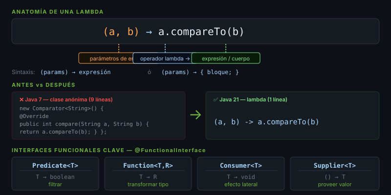

# Lambdas y Functional Interfaces

## 🎯 Objetivos
- Escribir expresiones lambda concisas
- Conocer las interfaces funcionales del JDK
- Usar referencias a métodos (`::`)

---



## 1. ¿Qué es una Lambda?

Una lambda es una función anónima — sin nombre, sin clase. Reemplaza clases anónimas verbosas.

```java
// ❌ Antes de Java 8 — anónimo verboso
Comparator<String> old = new Comparator<String>() {
    @Override
    public int compare(String a, String b) {
        return a.compareTo(b);
    }
};

// ✅ Con Lambda — conciso
Comparator<String> modern = (a, b) -> a.compareTo(b);
```

**Sintaxis:** `(parámetros) -> expresión` o `(parámetros) -> { bloque; }`

---

## 2. Interfaces Funcionales del JDK

Una **functional interface** tiene exactamente un método abstracto (`@FunctionalInterface`).

| Interfaz | Firma | Uso típico |
|----------|-------|-----------|
| `Predicate<T>` | `T → boolean` | Filtrar |
| `Function<T,R>` | `T → R` | Transformar |
| `Consumer<T>` | `T → void` | Efecto lateral |
| `Supplier<T>` | `() → T` | Crear/proveer |
| `BiFunction<T,U,R>` | `(T,U) → R` | Combinar dos valores |
| `UnaryOperator<T>` | `T → T` | Transformar mismo tipo |

```java
// Predicate<T> — retorna boolean
Predicate<String> isLong  = s -> s.length() > 5;
Predicate<String> isEmpty = String::isEmpty;        // referencia

// Function<T,R> — transforma
Function<String, Integer> toLength = String::length;
Function<String, String>  toUpper  = String::toUpperCase;

// Consumer<T> — efecto sin retorno
Consumer<String> print = System.out::println;

// Supplier<T> — provee un valor sin argumentos
Supplier<List<String>> newList = ArrayList::new;

// Composición
Function<String, String> pipeline = toUpper.andThen(s -> s.trim());
Predicate<String> longAndNotEmpty = isLong.and(isEmpty.negate());
```

---

## 3. Referencias a Métodos (`::`)

| Tipo | Sintaxis | Equivalente Lambda |
|------|----------|--------------------|
| Estático | `Clase::metodo` | `x -> Clase.metodo(x)` |
| Instancia (objeto) | `obj::metodo` | `x -> obj.metodo(x)` |
| Instancia (tipo) | `Tipo::metodo` | `(t, x) -> t.metodo(x)` |
| Constructor | `Clase::new` | `x -> new Clase(x)` |

```java
// Estático
Function<String, Integer>  parse   = Integer::parseInt;

// Instancia de objeto concreto
String prefix = "ITEM-";
Function<String, String>   addPrefix = prefix::concat;

// Instancia por tipo
Function<String, String>   trim    = String::trim;
BiFunction<String, String, Boolean> startsWith = String::startsWith;

// Constructor
Function<String, StringBuilder> build = StringBuilder::new;
```

---

## 4. Lambdas en la Práctica

```java
var products = List.of("apple", "banana", "cherry", "date", "elderberry");

// Encadenar predicados
Predicate<String> startsWithB = s -> s.startsWith("b");
Predicate<String> longerThan5 = s -> s.length() > 5;

products.stream()
        .filter(startsWithB.or(longerThan5))
        .map(String::toUpperCase)
        .forEach(System.out::println);
// Output: BANANA, CHERRY, ELDERBERRY
```

---

## ✅ Checklist
- [ ] Escribo lambdas de una línea sin llaves `{}`
- [ ] Uso `Function`, `Predicate`, `Consumer`, `Supplier` correctamente
- [ ] Sustituyo lambdas triviales por referencias `::` 
- [ ] Compongo predicados con `.and()`, `.or()`, `.negate()`
