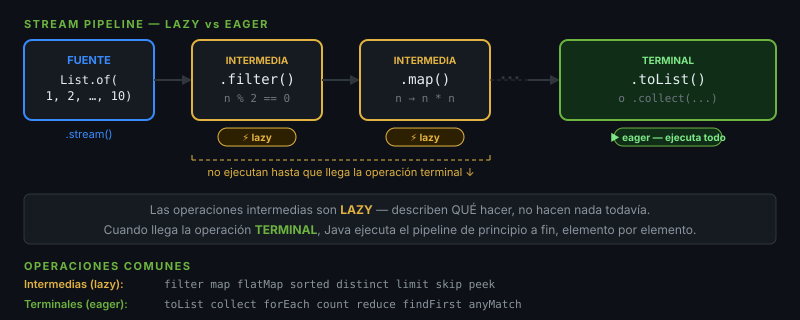

# Streams API

## 🎯 Objetivos
- Construir pipelines de procesamiento de datos
- Diferenciar operaciones intermedias y terminales
- Usar collectors para agrupar y resumir

---



## 1. Stream vs Collection

Un `Stream` **no almacena datos** — describe una secuencia de operaciones sobre una fuente.

```
Fuente → [op. intermedias, lazy] → Operación terminal (eager, produce resultado)
```

```java
var numbers = List.of(1, 2, 3, 4, 5, 6, 7, 8, 9, 10);

// Sin streams — verboso
var result = new ArrayList<Integer>();
for (var n : numbers) {
    if (n % 2 == 0) result.add(n * n);
}

// Con streams — declarativo
var result = numbers.stream()
        .filter(n -> n % 2 == 0)   // intermedia, lazy
        .map(n -> n * n)            // intermedia, lazy
        .toList();                  // terminal, ejecuta todo
```

---

## 2. Operaciones Intermedias (lazy)

```java
var words = List.of("spring", "boot", "java", "stream", "optional");

// filter — conservar elementos
words.stream().filter(w -> w.length() > 4)

// map — transformar T → R
words.stream().map(String::toUpperCase)

// flatMap — aplanar Stream<List<T>> → Stream<T>
List.of(List.of(1,2), List.of(3,4))
    .stream()
    .flatMap(Collection::stream)    // 1, 2, 3, 4

// sorted — orden natural o con comparator
words.stream().sorted()
words.stream().sorted(Comparator.comparingInt(String::length))

// distinct — eliminar duplicados
Stream.of(1,1,2,2,3).distinct()    // 1, 2, 3

// limit / skip
words.stream().skip(2).limit(3)

// peek — debug sin alterar (NO usar en producción como lógica)
words.stream().peek(w -> log.debug("Processing: {}", w))
```

---

## 3. Operaciones Terminales (eager)

```java
var nums = List.of(3, 1, 4, 1, 5, 9, 2, 6);

// collect — más flexible
List<Integer> list   = nums.stream().filter(n -> n > 3).collect(Collectors.toList());
List<Integer> list2  = nums.stream().filter(n -> n > 3).toList(); // Java 16+

// reduce
int sum = nums.stream().reduce(0, Integer::sum);
Optional<Integer> max = nums.stream().reduce(Integer::max);

// count, min, max, sum (para primitivos: IntStream)
long count = nums.stream().filter(n -> n > 3).count();
OptionalInt maxVal = nums.stream().mapToInt(i -> i).max();
int total  = nums.stream().mapToInt(i -> i).sum();

// findFirst, findAny
Optional<Integer> first = nums.stream().filter(n -> n > 4).findFirst();

// anyMatch, allMatch, noneMatch
boolean hasNine = nums.stream().anyMatch(n -> n == 9);
boolean allPos  = nums.stream().allMatch(n -> n > 0);
```

---

## 4. Collectors Avanzados

```java
record Product(String name, String category, double price) {}
var products = List.of(
    new Product("Laptop",  "Electronics", 999.0),
    new Product("Phone",   "Electronics", 599.0),
    new Product("Desk",    "Furniture",   299.0),
    new Product("Chair",   "Furniture",   199.0)
);

// groupingBy — Map<K, List<T>>
Map<String, List<Product>> byCategory =
        products.stream().collect(Collectors.groupingBy(Product::category));

// groupingBy + counting
Map<String, Long> countByCategory =
        products.stream().collect(Collectors.groupingBy(Product::category, Collectors.counting()));

// joining
String names = products.stream()
        .map(Product::name)
        .collect(Collectors.joining(", ", "[", "]"));
// "[Laptop, Phone, Desk, Chair]"

// summarizingDouble
DoubleSummaryStatistics stats =
        products.stream().collect(Collectors.summarizingDouble(Product::price));
// count, sum, min, max, average

// toMap
Map<String, Double> priceMap =
        products.stream().collect(Collectors.toMap(Product::name, Product::price));
```

---

## 5. Streams Paralelos

```java
// Solo para colecciones grandes (>10.000 elementos)
long count = numbers.parallelStream()
        .filter(n -> n % 2 == 0)
        .count();
// ⚠️ No usar con operaciones con estado mutable
```

---

## ✅ Checklist
- [ ] Encadenamiento fluido: `stream()` → ops intermedias → terminal
- [ ] Uso `toList()` en vez de `Collectors.toList()` (Java 16+)
- [ ] `groupingBy` para agrupar, `joining` para texto
- [ ] `mapToInt/Double/Long` para operaciones numéricas eficientes
- [ ] No termino un Stream sin operación terminal
