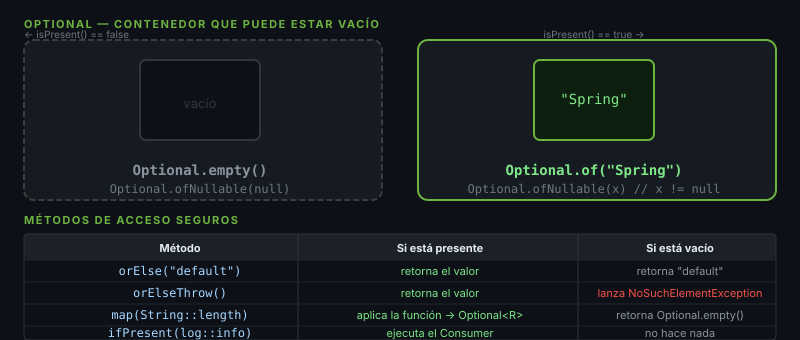

# Optional — Adiós al NullPointerException

## 🎯 Objetivos
- Eliminar `null` como valor de retorno
- Encadenar operaciones con `map` y `flatMap`
- Integrar Optional con Streams

---



## 1. El Problema con `null`

```java
// ❌ Propenso a NullPointerException
public String getCity(User user) {
    return user.getAddress().getCity(); // NPE si address es null
}

// ❌ Defensive programming — feo y verboso
public String getCity(User user) {
    if (user != null && user.getAddress() != null) {
        return user.getAddress().getCity();
    }
    return "Unknown";
}
```

---

## 2. Crear un Optional

```java
// Optional.of() — lanza NullPointerException si el valor es null
Optional<String> name = Optional.of("Spring Boot");

// Optional.ofNullable() — acepta null, lo envuelve
Optional<String> maybeNull = Optional.ofNullable(someMethod()); // puede ser null

// Optional.empty() — explícitamente vacío
Optional<String> empty = Optional.empty();
```

> **Regla:** Nunca retornar `Optional.of(null)` —
> usa `ofNullable` cuando el valor puede ser `null`.

---

## 3. Extraer el Valor

```java
Optional<String> city = Optional.of("Bogotá");

// orElse — valor por defecto (siempre se evalúa)
String c1 = city.orElse("Unknown");

// orElseGet — Supplier, evaluación lazy (preferidle a orElse con objetos costosos)
String c2 = city.orElseGet(() -> computeDefault());

// orElseThrow — lanza excepción si vacío
String c3 = city.orElseThrow(() -> new EntityNotFoundException("City not found"));

// ❌ NUNCA hacer esto — derrota el propósito de Optional
if (city.isPresent()) {
    String c4 = city.get(); // mismo riesgo que null
}
```

---

## 4. Transformar con `map` y `flatMap`

```java
record Address(String city, String country) {}
record User(String name, Address address) {}  // address puede ser null

Optional<User> user = findUser(1L);

// map — transforma Optional<T> → Optional<R>
Optional<String> cityName = user
        .map(User::address)       // Optional<Address>
        .map(Address::city);      // Optional<String>

// Con valor por defecto al final
String city = user
        .map(User::address)
        .map(Address::city)
        .orElse("N/A");

// flatMap — cuando el mapper ya retorna Optional
Optional<String> result = user
        .flatMap(u -> findAddress(u.name()))  // findAddress retorna Optional<Address>
        .map(Address::city);

// filter — mantiene el Optional solo si cumple el predicado
Optional<String> longCity = cityName.filter(c -> c.length() > 3);
```

---

## 5. Optional en Métodos de Repositorio

```java
// ✅ Correcto — método que puede no encontrar el valor
public Optional<User> findByEmail(String email) {
    return users.stream()
            .filter(u -> u.email().equals(email))
            .findFirst();
}

// ✅ Correcto — en el llamador
User user = userRepository.findByEmail("bob@example.com")
        .orElseThrow(() -> new UserNotFoundException("bob@example.com"));
```

---

## 6. Optional con ifPresent / ifPresentOrElse

```java
Optional<String> name = Optional.of("Spring");

// ifPresent — acción si hay valor
name.ifPresent(n -> System.out.println("Hello, " + n));

// ifPresentOrElse (Java 9+) — acción si hay valor, otra si no
name.ifPresentOrElse(
        n  -> System.out.println("Hello, " + n),
        () -> System.out.println("No name found")
);
```

---

## 7. Reglas de Oro

| ✅ Hacer | ❌ No hacer |
|---------|------------|
| Retornar `Optional<T>` cuando puede no haber valor | Retornar `Optional` de colecciones — mejor `List.of()` |
| Usar `orElseGet` con objetos costosos | Llamar `get()` sin `isPresent()` primero |
| Encadenar `map().filter().orElse()` | Usar `Optional` como campo de una entidad JPA |
| `orElseThrow()` en servicios | Pasar `Optional` como parámetro de método |

---

## ✅ Checklist
- [ ] Mis métodos de búsqueda retornan `Optional<T>`, no `null`
- [ ] Nunca llamo `.get()` directamente
- [ ] Encadeno con `.map()` y termino con `.orElse…()`
- [ ] Uso `orElseThrow()` en la capa de servicio para lanzar excepciones de dominio
