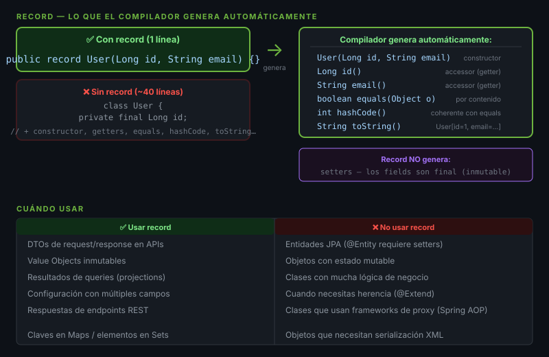

# Records, `var` y Switch Expressions

## 🎯 Objetivos
- Modelar datos inmutables con `record`
- Usar `var` para inferencia de tipos local
- Escribir switch expressions modernas

---



## 1. Records — DTOs Inmutables

Un `record` es una clase de datos inmutable. El compilador genera automáticamente:
`constructor`, `getters` (por nombre del campo), `equals()`, `hashCode()`, `toString()`.

```java
// ✅ Record — 1 línea
public record UserResponse(Long id, String email, String name) {}

// ❌ Equivalente sin record — 30+ líneas de boilerplate
public class UserResponse {
    private final Long id;
    private final String email;
    private final String name;
    // ... constructor, getters, equals, hashCode, toString
}
```

### Compact Constructor (validación)

```java
public record Product(String name, double price, int stock) {

    // Compact constructor — valida en creación
    public Product {
        if (price < 0)  throw new IllegalArgumentException("Price must be >= 0");
        if (stock < 0)  throw new IllegalArgumentException("Stock must be >= 0");
        name = name.trim(); // puede mutar parámetros antes de asignar
    }
}
```

### Métodos personalizados en Records

```java
public record Money(double amount, String currency) {

    // Método de instancia
    public Money add(Money other) {
        if (!currency.equals(other.currency))
            throw new IllegalArgumentException("Currency mismatch");
        return new Money(amount + other.amount, currency);
    }

    // Método estático factory
    public static Money usd(double amount) {
        return new Money(amount, "USD");
    }
}

var price = Money.usd(29.99);
var tax   = Money.usd(2.40);
var total = price.add(tax); // Money[amount=32.39, currency=USD]
```

### Cuándo usar Record vs Class

| Usar `record` | Usar `class` |
|---------------|-------------|
| DTO de entrada/salida de API | Entidad JPA (`@Entity`) |
| Objeto de valor inmutable | Objeto con estado mutable |
| Respuesta de servicio | Clase con lógica de negocio compleja |
| Resultado temporal en Stream | Objeto que necesita herencia |

---

## 2. `var` — Inferencia de Tipo Local

`var` deduce el tipo en variables locales. **No es tipado dinámico** — el tipo sigue siendo estático.

```java
// ✅ Bueno — tipo obvio en el contexto
var users       = new ArrayList<User>();
var name        = "Spring Boot";
var price       = 29.99;
var result      = userRepository.findAll();  // tipo inferido del retorno

// ✅ En bucles
for (var user : users) {
    System.out.println(user.name());
}

// ✅ En try-with-resources
try (var inputStream = Files.newInputStream(path)) {
    // ...
}

// ❌ No usar cuando el tipo no es obvio
var x = process();      // ¿qué tipo retorna process()?
var y = null;           // no compila — null no tiene tipo inferible
```

---

## 3. Switch Expressions (Java 14+)

```java
// ❌ Switch statement clásico — verboso, fall-through peligroso
String result;
switch (status) {
    case PENDING:
        result = "Waiting";
        break;
    case ACTIVE:
        result = "Running";
        break;
    default:
        result = "Unknown";
}

// ✅ Switch expression — compacto, seguro, retorna valor
String result = switch (status) {
    case PENDING   -> "Waiting";
    case ACTIVE    -> "Running";
    case COMPLETED -> "Done";
    case CANCELLED -> "Stopped";
    // Si el switch no es exhaustivo → error en compilación
};

// ✅ Con bloque y yield para lógica multi-línea
String label = switch (priority) {
    case HIGH -> "🔴 High";
    case MEDIUM -> "🟡 Medium";
    case LOW -> {
        var msg = "🟢 Low (" + priority.ordinal() + ")";
        yield msg;  // yield reemplaza a return dentro del bloque
    }
};
```

### Pattern Matching en Switch (Java 21)

```java
sealed interface Shape permits Circle, Rectangle, Triangle {}
record Circle(double radius)            implements Shape {}
record Rectangle(double w, double h)    implements Shape {}
record Triangle(double base, double h)  implements Shape {}

double area = switch (shape) {
    case Circle    c -> Math.PI * c.radius() * c.radius();
    case Rectangle r -> r.w() * r.h();
    case Triangle  t -> 0.5 * t.base() * t.h();
};
```

---

## 4. Pattern Matching con `instanceof` (Java 16+)

```java
// ❌ Antes — cast manual
if (obj instanceof String) {
    String s = (String) obj;
    System.out.println(s.length());
}

// ✅ Pattern matching — cast + asignación en una línea
if (obj instanceof String s) {
    System.out.println(s.length());
}

// Con guard (Java 21)
if (obj instanceof String s && s.length() > 5) {
    System.out.println("Long string: " + s);
}
```

---

## ✅ Checklist
- [ ] DTOs de API son `record`, no POJOs con boilerplate
- [ ] Compact constructors validan invariantes del dominio
- [ ] `var` solo donde el tipo es obvio por el contexto
- [ ] Switch expressions con `->` (sin `break`, sin fall-through)
- [ ] `yield` dentro de bloques `{}` en switch expression
