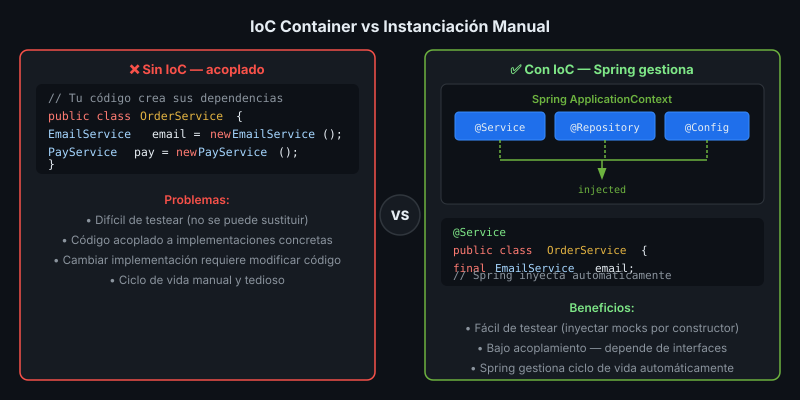

# IoC Container y Dependency Injection

## 🎯 Objetivos
- Entender Inversion of Control (IoC)
- Declarar y usar beans con `@Component`, `@Service`, `@Repository`
- Inyectar dependencias con `@Autowired` y constructor injection

---



## 1. Inversion of Control (IoC)

En la programación tradicional tu código instancia sus dependencias:

```java
// ❌ Sin IoC — tu código controla las dependencias
public class OrderService {
    private final EmailService emailService = new EmailService(); // acoplado
    private final PaymentService paymentService = new PaymentService();
}
```

Con **IoC**, el **container** (Spring) crea y gestiona los objetos. Tu código los **recibe**:

```java
// ✅ Con IoC — Spring controla las dependencias
@Service
public class OrderService {
    private final EmailService emailService;
    private final PaymentService paymentService;

    // Spring inyecta ambas dependencias automáticamente
    public OrderService(EmailService emailService, PaymentService paymentService) {
        this.emailService = emailService;
        this.paymentService = paymentService;
    }
}
```

**IoC invierte el control**: de "tú creas tus dependencias" a "el container te las entrega".

---

## 2. Dependency Injection (DI)

DI es el mecanismo concreto que usa Spring para implementar IoC. Hay 3 formas:

### Constructor Injection ✅ (recomendada)

```java
@Service
public class UserService {
    private final UserRepository userRepository;  // final — inmutable
    private final EmailService emailService;

    // Un solo constructor — Spring lo detecta automáticamente (no necesita @Autowired)
    public UserService(UserRepository userRepository, EmailService emailService) {
        this.userRepository = userRepository;
        this.emailService = emailService;
    }
}
```

**Ventajas:** dependencias explícitas, inmutables, fácil de testear (pasas mocks por constructor).

### Setter Injection (opcional/dependencias opcionales)

```java
@Service
public class ReportService {
    private NotificationService notificationService; // opcional

    @Autowired(required = false)
    public void setNotificationService(NotificationService s) {
        this.notificationService = s;
    }
}
```

### Field Injection ❌ (no recomendada en producción)

```java
// ❌ Difícil de testear, no permite campos final
@Service
public class ProductService {
    @Autowired
    private ProductRepository productRepository;
}
```

---

## 3. Stereotypes — Declarar Beans

Spring reconoce estas anotaciones estereotipo:

| Anotación | Capa | Descripción |
|-----------|------|-------------|
| `@Component` | Cualquiera | Bean genérico |
| `@Service` | Negocio | Lógica de negocio |
| `@Repository` | Datos | Acceso a BD + traducción de excepciones |
| `@Controller` | Web | Maneja requests HTTP |
| `@RestController` | Web | `@Controller` + `@ResponseBody` |

```java
@Repository
public class BookRepository { /* ... */ }

@Service
public class BookService {
    // Spring detecta e inyecta BookRepository
    public BookService(BookRepository repository) { /* ... */ }
}
```

---

## 4. `@Configuration` y `@Bean`

Para beans que no puedes anotar directamente (librerías de terceros):

```java
@Configuration
public class AppConfig {

    // Declara bean de tercero
    @Bean
    public ObjectMapper objectMapper() {
        var mapper = new ObjectMapper();
        mapper.configure(DeserializationFeature.FAIL_ON_UNKNOWN_PROPERTIES, false);
        return mapper;
    }

    // Bean condicional
    @Bean
    @ConditionalOnMissingBean
    public PasswordEncoder passwordEncoder() {
        return new BCryptPasswordEncoder();
    }
}
```

---

## 5. Application Context

El contenedor de Spring se llama `ApplicationContext`. Spring Boot lo crea automáticamente:

```
@SpringBootApplication
       ↓
Escanea @Component/@Service/@Repository en el paquete base
       ↓
Crea beans en el orden correcto resolviendo dependencias
       ↓
ApplicationContext listo → tu app arranca
```

---

## ✅ Checklist
- [ ] Uso constructor injection (no `@Autowired` en campos)
- [ ] Campos del servicio son `final`
- [ ] Uso `@Service`, `@Repository`, `@RestController` según la capa
- [ ] Beans de terceros declarados en `@Configuration + @Bean`
