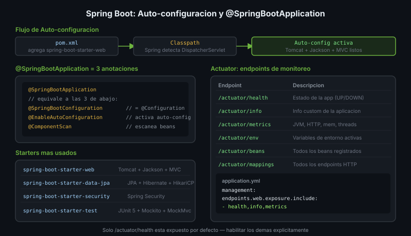

# Spring Boot Auto-configuration y Actuator



## 🎯 Objetivos
- Entender cómo funciona la auto-configuración
- Usar Spring Boot Actuator para monitoreo
- Configurar la aplicación para múltiples entornos

---

## 1. Auto-configuration

Spring Boot detecta el classpath y configura componentes automáticamente:

```
Agregar spring-boot-starter-web al pom.xml
         ↓
Spring detecta DispatcherServlet en classpath
         ↓
Auto-configura: Tomcat, Jackson, DispatcherServlet, MVC
         ↓
Tu app ya es un servidor HTTP sin configuración manual
```

Para ver qué se configuró:
```bash
# En application.yml
debug: true
# O en logs buscar: CONDITIONS EVALUATION REPORT
```

### `@SpringBootApplication`

Es una meta-anotación que combina 3:

```java
@SpringBootApplication
// equivale a:
@SpringBootConfiguration   // @Configuration
@EnableAutoConfiguration   // activar auto-config
@ComponentScan             // escanear beans en el paquete base
public class MyApp {
    public static void main(String[] args) {
        SpringApplication.run(MyApp.class, args);
    }
}
```

---

## 2. Starters — Dependencias Curadas

Los starters son POMs que agrupan dependencias compatibles:

```xml
<!-- Web API con Tomcat embebido -->
<dependency>
    <groupId>org.springframework.boot</groupId>
    <artifactId>spring-boot-starter-web</artifactId>
</dependency>

<!-- JPA + Hibernate + HikariCP -->
<dependency>
    <groupId>org.springframework.boot</groupId>
    <artifactId>spring-boot-starter-data-jpa</artifactId>
</dependency>

<!-- Tests: JUnit 5 + Mockito + MockMvc -->
<dependency>
    <groupId>org.springframework.boot</groupId>
    <artifactId>spring-boot-starter-test</artifactId>
    <scope>test</scope>
</dependency>
```

---

## 3. Spring Boot Actuator

Expone endpoints de monitoreo y métricas listos para producción:

```yaml
# application.yml
management:
  endpoints:
    web:
      exposure:
        include: health, info, metrics, env
  endpoint:
    health:
      show-details: always
```

| Endpoint | URL | Descripción |
|----------|-----|-------------|
| `/actuator/health` | `GET` | Estado de la app y sus dependencias |
| `/actuator/info` | `GET` | Información custom de la app |
| `/actuator/metrics` | `GET` | Métricas JVM, HTTP, etc. |
| `/actuator/env` | `GET` | Variables de entorno activas |

```yaml
# Información custom en /actuator/info
info:
  app:
    name: Products API
    version: 1.0.0
    description: REST API for product catalog
```

---

## 4. Embebido vs Externo

Spring Boot incluye un servidor Tomcat/Jetty/Undertow **embebido**:

```bash
# El JAR contiene todo — incluyendo el servidor
java -jar products-api.jar

# No necesitas desplegar en un servidor externo
# El JAR es ejecutable por sí mismo
```

---

## ✅ Checklist
- [ ] `@SpringBootApplication` en la clase principal con `main()`
- [ ] Starters en `pom.xml` — no agregar versiones (las gestiona el parent)
- [ ] Actuator habilitado en desarrollo
- [ ] `application.yml` separado por perfil (`dev`, `prod`)
