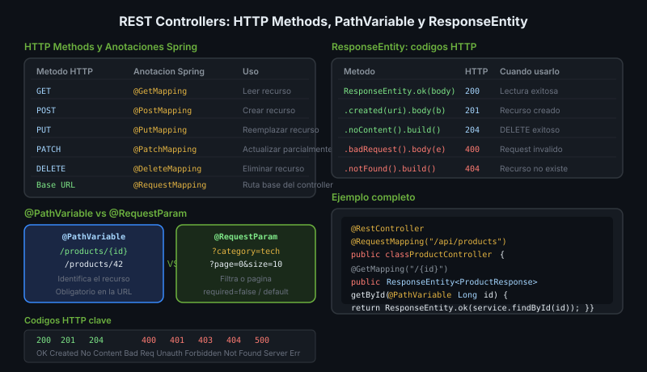

# REST Controllers — @RestController, endpoints y HTTP



## 🎯 Objetivos
- Crear endpoints REST con `@RestController`
- Manejar path params, query params y request body
- Retornar códigos HTTP apropiados con `ResponseEntity`

---

## 1. @RestController

```java
// @RestController = @Controller + @ResponseBody
// Serializa automáticamente el retorno a JSON (via Jackson)
@RestController
@RequestMapping("/api/products")  // ruta base del controlador
public class ProductController {
    // endpoints van aquí
}
```

---

## 2. HTTP Methods y Anotaciones

| HTTP | Anotación | Uso |
|------|-----------|-----|
| GET | `@GetMapping` | Leer recurso |
| POST | `@PostMapping` | Crear recurso |
| PUT | `@PutMapping` | Reemplazar recurso |
| PATCH | `@PatchMapping` | Actualizar parcialmente |
| DELETE | `@DeleteMapping` | Eliminar recurso |

```java
@RestController
@RequestMapping("/api/products")
public class ProductController {

    @GetMapping                          // GET /api/products
    public List<ProductResponse> getAll() { /* ... */ }

    @GetMapping("/{id}")                 // GET /api/products/42
    public ProductResponse getById(@PathVariable Long id) { /* ... */ }

    @PostMapping                         // POST /api/products
    public ProductResponse create(@RequestBody ProductRequest request) { /* ... */ }

    @PutMapping("/{id}")                 // PUT /api/products/42
    public ProductResponse update(@PathVariable Long id,
                                   @RequestBody ProductRequest request) { /* ... */ }

    @DeleteMapping("/{id}")              // DELETE /api/products/42
    public void delete(@PathVariable Long id) { /* ... */ }
}
```

---

## 3. Path Variables y Query Params

```java
// Path variable — parte de la URL
// GET /api/products/42
@GetMapping("/{id}")
public ProductResponse getById(@PathVariable Long id) {
    return productService.findById(id);
}

// Query params — ?category=electronics&available=true
// GET /api/products?category=electronics&available=true&page=0&size=10
@GetMapping
public List<ProductResponse> search(
        @RequestParam(required = false) String category,
        @RequestParam(defaultValue = "true") boolean available,
        @RequestParam(defaultValue = "0") int page,
        @RequestParam(defaultValue = "10") int size) {
    return productService.search(category, available, page, size);
}
```

---

## 4. ResponseEntity — Control del HTTP Response

```java
@GetMapping("/{id}")
public ResponseEntity<ProductResponse> getById(@PathVariable Long id) {
    return productService.findById(id)
            .map(ResponseEntity::ok)                         // 200 OK
            .orElse(ResponseEntity.notFound().build());     // 404 Not Found
}

@PostMapping
public ResponseEntity<ProductResponse> create(
        @RequestBody ProductRequest request) {
    var created = productService.create(request);
    var location = URI.create("/api/products/" + created.id());
    return ResponseEntity.created(location).body(created); // 201 Created
}

@DeleteMapping("/{id}")
public ResponseEntity<Void> delete(@PathVariable Long id) {
    productService.delete(id);
    return ResponseEntity.noContent().build();             // 204 No Content
}
```

---

## 5. Records como DTOs

```java
// Request — recibe datos del cliente
public record ProductRequest(String name, String category, double price) {}

// Response — envía datos al cliente (nunca exponer @Entity directamente)
public record ProductResponse(Long id, String name, String category, double price) {}
```

---

## 6. Códigos HTTP Comunes en REST

| Código | Significado | Cuándo usarlo |
|--------|-------------|---------------|
| 200 OK | Éxito | GET con resultado |
| 201 Created | Recurso creado | POST exitoso → include `Location` header |
| 204 No Content | Sin cuerpo | DELETE, PUT exitoso sin cuerpo |
| 400 Bad Request | Datos inválidos | Validación fallida |
| 401 Unauthorized | No autenticado | Sin token / credenciales |
| 403 Forbidden | Sin permiso | Autenticado pero sin autorización |
| 404 Not Found | No encontrado | Recurso no existe |
| 409 Conflict | Conflicto | Email duplicado, etc. |
| 500 Internal Server Error | Error del servidor | Excepción no manejada |

---

## ✅ Checklist
- [ ] `@RequestMapping` con la ruta base en el controlador
- [ ] `@PathVariable` para IDs en la URL, `@RequestParam` para filtros opcionales
- [ ] Retornar `ResponseEntity<T>` para controlar el status HTTP
- [ ] Records como DTOs — nunca exponer entidades JPA directamente
- [ ] POST retorna 201 con header `Location`
