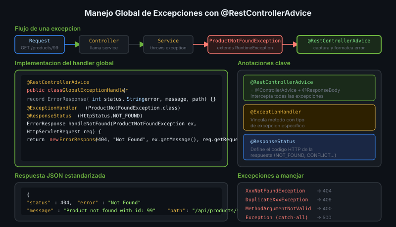

# Manejo Global de Excepciones



## 🎯 Objetivos
- Centralizar el manejo de errores con `@ControllerAdvice`
- Retornar respuestas de error consistentes
- Mapear excepciones personalizadas a códigos HTTP

---

## 1. El Problema sin Manejo Global

Sin manejo centralizado, Spring retorna respuestas de error inconsistentes:

```json
// ❌ Error genérico de Spring — no útil para el cliente
{
  "timestamp": "2024-01-15T10:30:00.000+00:00",
  "status": 500,
  "error": "Internal Server Error",
  "path": "/api/products/99"
}
```

---

## 2. Excepción Personalizada

```java
// Excepción de dominio — semánticamente clara
public class ProductNotFoundException extends RuntimeException {
    public ProductNotFoundException(Long id) {
        super("Product not found with id: " + id);
    }
}

public class DuplicateEmailException extends RuntimeException {
    public DuplicateEmailException(String email) {
        super("Email already registered: " + email);
    }
}
```

---

## 3. `@ControllerAdvice` — Handler Global

```java
@RestControllerAdvice  // = @ControllerAdvice + @ResponseBody
public class GlobalExceptionHandler {

    // Record para la respuesta de error estandarizada
    record ErrorResponse(int status, String error, String message, String path) {}

    @ExceptionHandler(ProductNotFoundException.class)
    @ResponseStatus(HttpStatus.NOT_FOUND)
    ErrorResponse handleNotFound(ProductNotFoundException ex,
                                  HttpServletRequest request) {
        return new ErrorResponse(404, "Not Found", ex.getMessage(), request.getRequestURI());
    }

    @ExceptionHandler(DuplicateEmailException.class)
    @ResponseStatus(HttpStatus.CONFLICT)
    ErrorResponse handleConflict(DuplicateEmailException ex,
                                  HttpServletRequest request) {
        return new ErrorResponse(409, "Conflict", ex.getMessage(), request.getRequestURI());
    }

    // Catch-all para errores inesperados
    @ExceptionHandler(Exception.class)
    @ResponseStatus(HttpStatus.INTERNAL_SERVER_ERROR)
    ErrorResponse handleGeneric(Exception ex, HttpServletRequest request) {
        // ⚠️ No exponer detalles internos en producción
        return new ErrorResponse(500, "Internal Server Error",
                "An unexpected error occurred", request.getRequestURI());
    }
}
```

---

## 4. Respuesta de Error Estandarizada

```json
// ✅ Error consistente y útil para el cliente
{
  "status": 404,
  "error": "Not Found",
  "message": "Product not found with id: 99",
  "path": "/api/products/99"
}
```

---

## 5. Uso en el Service

```java
@Service
public class ProductService {

    public ProductResponse findById(Long id) {
        return productRepository.findById(id)
                .map(this::toResponse)
                // La excepción se lanza aquí y el @ControllerAdvice la captura
                .orElseThrow(() -> new ProductNotFoundException(id));
    }
}
```

---

## ✅ Checklist
- [ ] Excepciones de dominio extienden `RuntimeException`
- [ ] Un solo `@RestControllerAdvice` en el paquete `exception/`
- [ ] `ErrorResponse` record con status, error, message, path
- [ ] No exponer stack traces en producción
- [ ] Catch-all para `Exception.class` como último recurso
