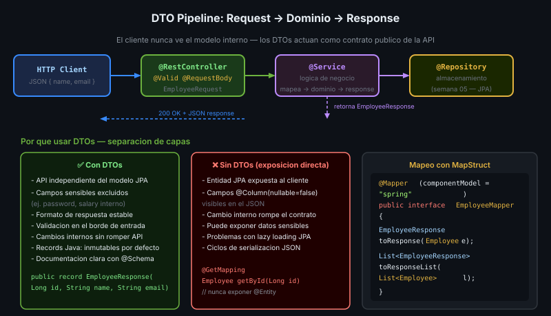

# DTOs y MapStruct



## 🎯 Objetivos
- Entender cuándo y por qué usar DTOs
- Mapear entre entidades y DTOs con MapStruct
- Crear mappings personalizados

---

## 1. ¿Por qué DTOs?

La entidad JPA tiene toda la información interna. El DTO expone solo lo necesario:

```java
// ❌ Sin DTO — expone campos internos, passwords, y datos sensibles
@GetMapping("/{id}")
public Employee getEmployee(@PathVariable Long id) {
    return employeeRepository.findById(id); // expone password, audit fields, etc.
}

// ✅ Con DTO — control preciso de qué se expone
@GetMapping("/{id}")
public EmployeeResponse getEmployee(@PathVariable Long id) {
    var employee = employeeService.findById(id);
    return mapper.toResponse(employee); // solo nombre, email, departamento
}
```

**Reglas de oro:**
- Request DTO: datos que recibe la API del cliente
- Response DTO: datos que envía la API al cliente
- Nunca exponer `@Entity` directamente en la API

---

## 2. MapStruct — Generación de Mappers

MapStruct genera el código de mapeo en tiempo de compilación (sin reflexión = eficiente).

### Dependencia

```xml
<dependency>
    <groupId>org.mapstruct</groupId>
    <artifactId>mapstruct</artifactId>
    <version>1.6.3</version>
</dependency>
<dependency>
    <groupId>org.mapstruct</groupId>
    <artifactId>mapstruct-processor</artifactId>
    <version>1.6.3</version>
    <scope>provided</scope>
</dependency>
```

### Mapper básico

```java
// Employee.java (entidad JPA — semana 05)
@Entity
public class Employee {
    private Long id;
    private String firstName;
    private String lastName;
    private String email;
    private String passwordHash; // no debe ir en el response
    private String department;
    private double salary;
}

// EmployeeResponse.java (DTO)
public record EmployeeResponse(
    Long id,
    String fullName,    // = firstName + " " + lastName
    String email,
    String department
) {}

// EmployeeMapper.java
@Mapper(componentModel = "spring")  // bean de Spring
public interface EmployeeMapper {

    // MapStruct mapea campos con el mismo nombre automáticamente
    @Mapping(target = "fullName",
             expression = "java(employee.getFirstName() + \" \" + employee.getLastName())")
    EmployeeResponse toResponse(Employee employee);

    // Si los campos coinciden exactamente:
    Employee toEntity(EmployeeRequest request);

    // Mapear lista
    List<EmployeeResponse> toResponseList(List<Employee> employees);
}
```

### Uso en el Service

```java
@Service
public class EmployeeService {
    private final EmployeeRepository repository;
    private final EmployeeMapper mapper;

    public EmployeeResponse findById(Long id) {
        return repository.findById(id)
                .map(mapper::toResponse)
                .orElseThrow(() -> new EmployeeNotFoundException(id));
    }
}
```

---

## 3. Mappings Personalizados

```java
@Mapper(componentModel = "spring")
public interface OrderMapper {

    // Ignorar campo
    @Mapping(target = "internalNotes", ignore = true)
    OrderResponse toResponse(Order order);

    // Campo con nombre diferente
    @Mapping(source = "customer.email", target = "customerEmail")
    @Mapping(source = "totalAmount", target = "total")
    OrderSummary toSummary(Order order);

    // Método con implementación default (para lógica custom)
    default String mapStatus(OrderStatus status) {
        return switch (status) {
            case PENDING   -> "Waiting for payment";
            case CONFIRMED -> "Order confirmed";
            case SHIPPED   -> "In transit";
            case DELIVERED -> "Delivered";
        };
    }
}
```

---

## ✅ Checklist
- [ ] MapStruct en pom.xml (mapstruct + mapstruct-processor)
- [ ] `@Mapper(componentModel = "spring")` en todas las interfaces de mapper
- [ ] `@Mapping(target = "...", ignore = true)` para campos sensibles
- [ ] Nunca retornar entidades `@Entity` desde controllers
- [ ] Tests de mappers con `mapstruct-spring-extensions` o instanciación directa
