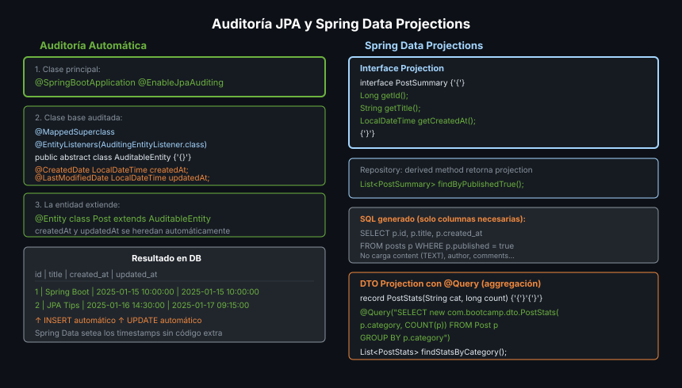

# JPA — Auditoría y Proyecciones



## 🎯 Objetivos
- Usar `@CreatedDate`, `@LastModifiedDate` con Spring Data Auditing
- Extraer solo los campos necesarios con Projections

---

## 1. Auditoría Automática

```java
// 1. Habilitar en la clase principal
@SpringBootApplication
@EnableJpaAuditing
public class BlogApiApplication { ... }

// 2. Crear clase base auditada
@MappedSuperclass
@EntityListeners(AuditingEntityListener.class)
public abstract class AuditableEntity {

    @CreatedDate
    @Column(name = "created_at", nullable = false, updatable = false)
    private LocalDateTime createdAt;

    @LastModifiedDate
    @Column(name = "updated_at")
    private LocalDateTime updatedAt;
}

// 3. Extender en entidades
@Entity
public class Post extends AuditableEntity {
    @Id @GeneratedValue private Long id;
    private String title;
    // createdAt y updatedAt heredados
}
```

---

## 2. Auditoría de Usuario

```java
@EnableJpaAuditing(auditorAwareRef = "auditorProvider")
public class BlogApiApplication { ... }

@Bean
AuditorAware<String> auditorProvider() {
    // Por ahora retorna nombre fijo; en seguridad usará el usuario autenticado
    return () -> Optional.of("system");
}

@MappedSuperclass
@EntityListeners(AuditingEntityListener.class)
public abstract class AuditableEntity {
    @CreatedBy
    @Column(name = "created_by", updatable = false)
    private String createdBy;

    @LastModifiedBy
    @Column(name = "updated_by")
    private String updatedBy;
}
```

---

## 3. Projections — Solo lo que necesitas

```java
// Interface projection — JPA genera la implementación
public interface PostSummary {
    Long getId();
    String getTitle();
    LocalDateTime getCreatedAt();

    // Nested projection
    AuthorInfo getAuthor();
    interface AuthorInfo {
        String getName();
    }
}

// Repository
List<PostSummary> findByPublishedTrue();

// Uso — solo selecciona id, title, created_at, author.name (no todos los campos)
var summaries = postRepository.findByPublishedTrue();
```

---

## 4. DTO Projection con @Query

```java
// DTO record
public record PostStats(String category, long count, double avgRating) {}

// Repository con constructor expression
@Query("SELECT new com.bootcamp.dto.PostStats(p.category, COUNT(p), AVG(p.rating)) " +
       "FROM Post p GROUP BY p.category")
List<PostStats> findStatsByCategory();
```

---

## ✅ Checklist de Verificación
- [ ] `@EnableJpaAuditing` en la clase principal
- [ ] `@EntityListeners(AuditingEntityListener.class)` en la entidad/superclase
- [ ] `@CreatedDate` / `@LastModifiedDate` en campos `LocalDateTime`
- [ ] Interface Projections para queries de listado (evita SELECT *)
- [ ] DTO Projection con `new` para queries de agregación
